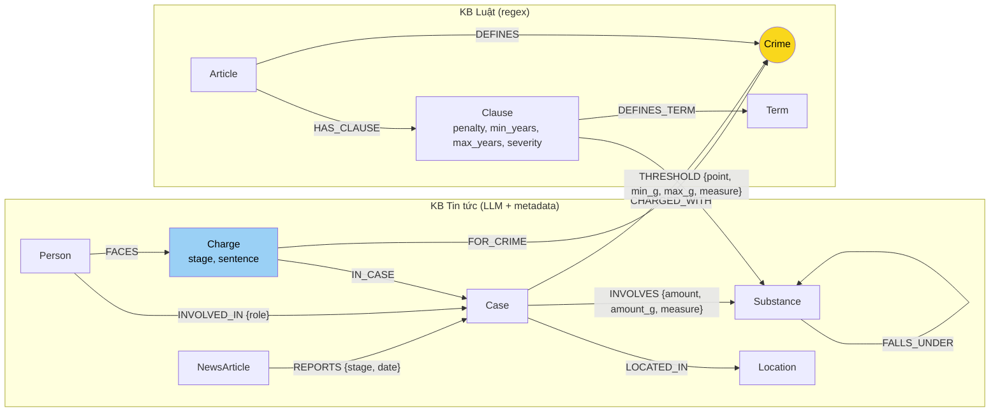

# Thiết kế Ontology — Day 19

**Họ tên:** Nguyễn Việt Hưng  **MSSV:** 2A202602972

**Lựa chọn** (đánh dấu một):
- [ ] Dùng ontology gợi ý (có thể chỉnh nhỏ)
- [x] Tự thiết kế (xét bonus +15, xem `SUBMISSION.md`)

> Thiết kế dựa trên việc đọc toàn bộ 18 Điều luật và 20 bài báo (không chỉ 3–4 bài). Các quan sát dẫn tới thiết kế được ghi ở mục 0.

## 0. Quan sát dữ liệu dẫn tới thiết kế

| # | Quan sát (kiểm chứng được trên dữ liệu) | Hệ quả cho ontology |
| --- | --- | --- |
| O1 | Cùng một vụ xuất hiện ở nhiều bài: "Hoàng Nato" ở 4 bài (`news-100260920…`, `…922…`, `…924095…`, `…925…`), vụ Viện Pháp y tâm thần ở 2 bài (`…924105…`, `…930…`) | `Case` không thể khóa theo tên LLM đặt cho từng bài; cần gộp vụ qua **người bị buộc tội chung** |
| O2 | Một người có thể được gọi bằng biệt danh: "Hoàng Nato" = Dương Minh Tuấn, "Phannhibeauty" = Phan Kim Nhi | `Person` khóa theo họ tên đã chuẩn hóa, **biệt danh trỏ về cùng khóa** |
| O3 | Trong cùng một vụ, mỗi người một tội và một mức án: vụ 36kg có 4 bị cáo "mua bán" (2 tử hình) và 2 bị cáo "tổ chức sử dụng" (2 năm 6 tháng) | Tội danh + mức án là thuộc tính của **(người, tội, giai đoạn)**, không phải của vụ |
| O4 | Bài báo ở các giai đoạn tố tụng khác nhau: bắt giữ ("Hoàng Nato"), truy tố/chuẩn bị xét xử (Cái Quang Huy), sơ thẩm (vụ 36kg), phúc thẩm (Lê Minh Thành) | Mỗi buộc tội gắn **giai đoạn**; mức án chỉ có nghĩa ở giai đoạn xét xử |
| O5 | Khoản 2–4 của Điều 248–253 phân biệt theo **ngưỡng khối lượng** (125 điểm có "gam/kilôgam/mililít"), ví dụ Điều 250 điểm 4b: MDMA ≥ 100 gam → tù 20 năm, chung thân hoặc tử hình | Ngưỡng là dữ liệu có cấu trúc (min, max, đơn vị) cần lưu trên graph để so với khối lượng trong vụ |
| O6 | Báo dùng tên chất khác luật: "thuốc lắc", "kẹo" (MDMA), "ma túy đá" (Methamphetamine), "ke" (Ketamine); có chất luật không nêu tên (Ketamine, Etomidate) và luật xếp chúng vào "các chất ma túy khác" | Cần bảng **đồng nghĩa** và quan hệ **chất → nhóm chất trong luật** |
| O7 | Đoạn cuối của 17/20 bài báo là sapo của **bài khác** (crawl dính khối "tin liên quan"). 8 bài trùng khớp nguyên văn với sapo của một bài khác trong corpus, 9 bài là sapo bài ngoài corpus (bar F1, rửa tiền Campuchia…). Ví dụ: bài Lê Minh Thành kết thúc bằng sapo bài Cái Quang Huy; bài Công đoàn kết thúc bằng tin bắt "Đức Cộng"; bài Biên phòng 20kg kết thúc bằng tin Phannhibeauty | Khi trích xuất phải tách đoạn cuối ra, nếu không LLM gán người/vụ của bài khác vào bài này |
| O8 | Điều 2 Luật PCMT là 14 định nghĩa dạng "X là …" (Q1 hỏi "tiền chất là gì") | Thêm node `Term` (thuật ngữ) để câu hỏi định nghĩa đi thẳng tới khoản định nghĩa |

## 1. Sơ đồ

**Node cầu nối:** `Crime` (vàng). `Charge` (xanh) là node n-ngôi nối người, vụ, tội và giai đoạn.

## 2. Entity types (node labels)

| Label | Ý nghĩa | Khóa định danh (`MERGE` theo) | Properties | Lấy từ KB nào | Trích bằng |
| --- | --- | --- | --- | --- | --- |
| `Article` | Một Điều luật | `id` ("Điều 251 BLHS") | `title, law, doc_id` | Luật | regex + front matter |
| `Clause` | Một khoản của Điều | `id` ("Điều 251 BLHS khoản 4") | `number, penalty, min_years, max_years, severity, text, doc_id` | Luật | regex |
| `Crime` | Tội danh chuẩn (tiêu đề Điều) | `name` (đã `normalize_crime`) | `name` | Luật (tạo), Tin (nối vào) | regex; phía tin dùng `link_entity` |
| `Term` | Thuật ngữ được luật định nghĩa | `name` (chữ thường) | `name, definition, doc_id` | Luật (Điều 2 PCMT) | regex "X là …" |
| `Substance` | Chất ma túy hoặc nhóm chất theo luật | `name` (tên chuẩn) | `name, aliases, in_law` | Cả hai | regex (luật); LLM + bảng đồng nghĩa + `link_entity` (tin) |
| `NewsArticle` | Một bài báo (nguồn) | `doc_id` | `doc_id, title, published` | Tin | front matter, không cần LLM |
| `Case` | Một vụ án ngoài đời (có thể nhiều bài) | `case_id`, do code sinh khi phân giải thực thể | `case_id, name, summary, doc_ids` | Tin | LLM + phân giải trong code |
| `Person` | Một người liên quan vụ án | `pid` = họ tên chuẩn hóa (NFC, chữ thường, gộp khoảng trắng) | `pid, name, aliases, doc_ids` | Tin | LLM + phân giải biệt danh trong code |
| `Charge` | Một lần buộc tội: người × tội × giai đoạn, theo một bài báo | `id` = `doc_id|pid|crime|stage` | `stage, sentence, charge_text, doc_id` | Tin | LLM, tội nối bằng `link_entity` |
| `Location` | Tỉnh/thành | `name` (chuẩn hóa: "TP.HCM", "Hà Nội"…) | `name` | Tin | LLM + bảng chuẩn hóa |

`Crime`, `Substance`, `Location`, `Case`, `Person` là **node dùng chung** giữa nhiều tài liệu nên không mang `doc_id` (`Case`/`Person` lưu danh sách `doc_ids`). Mọi node sinh ra từ đúng một tài liệu (`Article`, `Clause`, `Term`, `NewsArticle`, `Charge`) đều có `doc_id` theo hợp đồng.

## 3. Relationships

| Type | Từ → Đến | Properties trên cạnh | Ý nghĩa |
| --- | --- | --- | --- |
| `DEFINES` | Article → Crime | – | Điều luật định nghĩa tội (phía luật của cầu nối) |
| `HAS_CLAUSE` | Article → Clause | – | Điều gồm các khoản |
| `THRESHOLD` | Clause → Substance | `point, min_g, max_g, measure` (`mass`: gam / `volume`: mililít) | Điểm của khoản áp dụng khi khối lượng chất trong `[min_g, max_g)`; `max_g = null` nghĩa là "trở lên" |
| `DEFINES_TERM` | Clause → Term | – | Khoản định nghĩa thuật ngữ |
| `FALLS_UNDER` | Substance → Substance | – | Chất luật không nêu tên (Ketamine, Etomidate…) thuộc nhóm "chất ma túy khác (rắn/lỏng)" để tra ngưỡng |
| `REPORTS` | NewsArticle → Case | `stage, date` | Bài báo đưa tin về vụ ở giai đoạn nào |
| `CHARGED_WITH` | Case → Crime | – | Vụ liên quan tội này (hợp của các `Charge`, và tội báo nêu ở cấp vụ) |
| `INVOLVES` | Case → Substance | `amount` (nguyên văn), `amount_g` (số, quy về gam hoặc mililít), `measure` | Chất và khối lượng trong vụ |
| `LOCATED_IN` | Case → Location | – | Nơi xảy ra |
| `INVOLVED_IN` | Person → Case | `role` (bị cáo / bị can / nghi phạm / người liên quan) | Vai trò của người trong vụ |
| `FACES` | Person → Charge | – | Người bị buộc tội |
| `FOR_CRIME` | Charge → Crime | – | Buộc tội về tội danh nào (phía tin của cầu nối) |
| `IN_CASE` | Charge → Case | – | Buộc tội thuộc vụ nào |

## 4. Node cầu nối giữa 2 KB

- **Node nào:** `Crime`. Phía luật: `(Article)-[:DEFINES]->(Crime)`. Phía tin có hai đường: `(Charge)-[:FOR_CRIME]->(Crime)` (cấp người) và `(Case)-[:CHARGED_WITH]->(Crime)` (cấp vụ).
- **Vì sao chọn node này:** tội danh là thứ duy nhất **cả hai KB cùng gọi tên**. Luật đặt tội ở tiêu đề Điều; báo viết "về tội …" hoặc "về hành vi …". Chất ma túy cũng có ở cả hai bên, nhưng một chất (MDMA) có mặt ở 5 Điều (248–252), nên không xác định được Điều nào áp dụng. Chất được dùng làm **cầu thứ hai**, để chọn *khoản* trong Điều đã chọn qua `Crime` (`INVOLVES` ↔ `THRESHOLD`).
- **Cách đảm bảo hai phía khớp tên:**
  1. Tên tội phía luật lấy bằng regex từ tiêu đề Điều rồi `normalize_crime` (bỏ "Tội", chữ thường).
  2. Prompt trích xuất đưa **nguyên văn danh sách 13 tội chuẩn** và yêu cầu chọn trong danh sách.
  3. Kết quả LLM vẫn đi qua `link_entity` (chuẩn hóa hai phía, khớp chính xác rồi tới `difflib` với cutoff 0.8). Không khớp thì **không nối** thay vì đoán.
  4. Báo hay viết "về **hành vi** tổ chức sử dụng…" thay vì "về **tội**…". `normalize_crime` chỉ bỏ tiền tố "tội ", nên code bỏ thêm tiền tố "hành vi " trước khi link.
- **Khi nào cầu gãy, và xử lý thế nào:**
  - Báo nêu tội ngoài Chương XX (ví dụ "nhận hối lộ", "đánh bạc" trong vụ Viện Pháp y): `link_entity` trả `None`, nên không nối. Đây là **gãy đúng**, vì KB luật không có các Điều đó. Nguyên văn vẫn được giữ ở `Charge.charge_text` để LLM trả lời vẫn thấy.
  - Bài chỉ có hành vi, không có tội (ví dụ "sử dụng trái phép chất ma túy" là vi phạm hành chính, không có Điều nào trong BLHS): gãy đúng, ghi nhận như trên.
  - Kiểm tra định kỳ bằng Cypher (E1): `MATCH (k:Case) WHERE NOT (k)-[:CHARGED_WITH]->() RETURN k.name, k.doc_ids`.

## 5. Competency questions

| Câu | Đường đi (Cypher pattern) | Trả lời được? |
| --- | --- | --- |
| Q1 | `(:Term {name:'tiền chất'})<-[:DEFINES_TERM]-(:Clause)<-[:HAS_CLAUSE]-(:Article {id:'Điều 2 Luật PCMT'})`; `Term.definition` chứa nguyên văn định nghĩa | Có. Ontology gợi ý chỉ có cách dựa vào vector search |
| Q2 | `(:NewsArticle)-[:REPORTS]->(k:Case)<-[:IN_CASE]-(ch:Charge)<-[:FACES]-(p:Person)` với `ch.sentence CONTAINS 'tử hình'`; vụ được tìm qua chunk vector (`doc_id`) | Có, nếu LLM trích đủ `sentence` cho từng người |
| Q3 | `(p:Person {name:'Lê Minh Thành'})-[:FACES]->(ch:Charge)-[:FOR_CRIME]->(:Crime)<-[:DEFINES]-(a:Article)-[:HAS_CLAUSE]->(cl:Clause {number:1})`; mức án ở `ch.sentence`, giai đoạn ở `ch.stage` (sơ thẩm) | Có |
| Q4 | `(p:Person) WHERE 'Hoàng Nato' IN p.aliases` → `-[:FACES]->(:Charge {stage:'bắt giữ'})-[:FOR_CRIME]->(:Crime)<-[:DEFINES]-(:Article)-[:HAS_CLAUSE]->(cl:Clause)` lấy khoản có `severity` cao nhất (Điều 255 khoản 4: tù 20 năm hoặc chung thân) | Có. Ontology gợi ý chỉ lấy khoản 1 + khoản nhắc chất (Etomidate không có trong luật), nên **hụt khoản tối đa** |
| Q5 | `(p:Person {name:'Cái Quang Huy'})-[:FACES]->(ch:Charge)-[:FOR_CRIME]->(:Crime)<-[:DEFINES]-(:Article)-[:HAS_CLAUSE]->(cl:Clause)-[t:THRESHOLD]->(s:Substance)<-[i:INVOLVES]-(k:Case)<-[:IN_CASE]-(ch)` với `t.min_g <= i.amount_g AND (t.max_g IS NULL OR i.amount_g < t.max_g)` | Có: 9.600 g MDMA ≥ 100 g → Điều 250 khoản 4 điểm b. Ontology gợi ý trả về cả khoản 2, 3, 4 (đều nhắc MDMA) và để LLM tự đoán |
| Q6 | `(k:Case)-[:INVOLVES]->(:Substance {name:'MDMA'})`, kèm `(k)<-[:INVOLVED_IN]-(p:Person)`; "thuốc lắc"/"kẹo" đã được gộp về MDMA khi trích | Có (truy vấn tổng hợp). Phụ thuộc LLM có trích đủ chất trong từng bài hay không |

**Không trả lời được / chấp nhận:**
- Khối lượng **theo từng người** (Nguyễn Tiến Đạt chịu 4,3kg, Cái Quang Huy 9,6kg trong cùng vụ): `INVOLVES` ở cấp vụ, nên chỉ lưu tổng của vụ. Chấp nhận vì cả hai đều vượt cùng ngưỡng; muốn chính xác phải chuyển `amount` sang `Charge`.
- Tình tiết định khung **không phải khối lượng** (có tổ chức, tái phạm nguy hiểm, qua biên giới): chỉ có trong `Clause.text`, không có cạnh riêng. LLM phải đọc text.

## 6. Quyết định thiết kế và đánh đổi

1. **Buộc tội là node (`Charge`) thay vì thuộc tính trên `INVOLVED_IN`.**
   - *Phương án khác:* `INVOLVED_IN {role, sentence, charge}` như gợi ý.
   - *Vì sao chọn:* một người có thể bị buộc nhiều tội, mỗi tội ở nhiều giai đoạn (O3, O4). Thuộc tính `charge` dạng chuỗi trên cạnh thì không nối được vào `Crime`, nên cầu nối chỉ đi qua cấp vụ và sai cho vụ có nhiều tội (vụ 36kg).
   - *Đánh đổi:* thêm 1 bước đi (Person → Charge → Crime) và thêm node (1 node/người/tội/giai đoạn/bài).
2. **Phân giải thực thể bằng code, không dựa vào tên LLM đặt.** `Person.pid` = họ tên chuẩn hóa, biệt danh trỏ về cùng `pid`. `Case.case_id` được gán khi gộp: vụ mới trích được **dùng chung ít nhất một người bị buộc tội** (bị cáo/bị can/nghi phạm) với vụ đã có thì gộp vào vụ đó.
   - *Phương án khác:* (a) khóa theo tên LLM (gợi ý), bị trùng; (b) gọi LLM lần 2 để so khớp vụ, tốn thêm token và không tất định.
   - *Đánh đổi:* hai người trùng họ tên ở hai vụ khác nhau sẽ bị gộp nhầm. Chấp nhận với 20 bài; kho lớn cần thêm năm sinh hoặc quê quán vào khóa.
3. **Ngưỡng khối lượng là cạnh `THRESHOLD {min_g, max_g}` trích bằng regex, so khớp bằng Cypher.**
   - *Phương án khác:* (a) `MENTIONS` không có số (gợi ý), để LLM tự so; (b) node `Point` riêng cho từng điểm.
   - *Vì sao chọn:* so sánh số là việc LLM hay sai mà Cypher làm đúng tuyệt đối; đặt ngưỡng lên cạnh thì không cần thêm label. Khối lượng phía tin được quy về gam/mililít bằng code (`9,6kg` → 9600).
   - *Đánh đổi:* regex phải chịu được biến thể ("tù" gõ sai thành "từ", "0,1 gam", "1.000 gam"). Trường hợp nhiều chất cộng dồn (điểm "có 02 chất ma túy trở lên…") không được mô hình hóa.
4. **Lấy thêm khoản có khung nặng nhất (`Clause.severity`) cho mỗi Điều đi tới.**
   - *Phương án khác:* chỉ khoản 1 + khoản nhắc chất (gợi ý), hoặc lấy hết mọi khoản (prompt dài gấp ~4 lần).
   - *Vì sao chọn:* câu hỏi "tối đa bao nhiêu" (Q4) cần khoản nặng nhất. Thêm 1 khoản/Điều rẻ hơn nhiều so với lấy hết.
5. **Tách đoạn cuối bài báo (O7) khỏi phần trích xuất.**
   - *Đánh đổi:* 3/20 bài (`…920221957595`, `…930085028036`, `…1002184934505`) có đoạn cuối là nội dung thật. Đã đọc cả 3: không đoạn nào có người hay tội mới chưa xuất hiện ở phần trên của bài, nên bỏ đi không mất dữ kiện.

## 7. So với ontology gợi ý (bắt buộc nếu xét bonus)

Hai file kết quả được sinh từ **cùng một code** (`src/graph.py`), chỉ khác biến môi trường: `KG_ONTOLOGY=hint python bench_kg.py --judge --out ket_qua_benchmark_kg.hint.txt` (ontology gợi ý, dùng nguyên các hàm HINT) và `python bench_kg.py --judge` (ontology này). Cùng chat model, cùng embedding, cùng 176 chunk.

**Tổng quan trước / sau** (pipeline graph, trung bình 6 câu):

| | Gợi ý (`.hint.txt`) | Ontology này (`ket_qua_benchmark_kg.txt`) |
| --- | --- | --- |
| Graph | 200 node / 381 cạnh | 259 node / 579 cạnh |
| recall / judge | 0.94 / 1.83 | 0.94 / **2.00** |
| in_tok mỗi câu | 5234 | **2102** (−60%) |
| USD mỗi câu | 0.00194 | **0.00093** (−52%) |
| Indexing USD | 0.02431 | 0.02645 (+9%, prompt trích xuất dài hơn) |

| Điểm khác | Gợi ý làm gì | Bạn làm gì | Vấn đề nó giải quyết | Bằng chứng (Cypher, hoặc số liệu benchmark) |
| --- | --- | --- | --- | --- |
| Khóa `Case`/`Person` | `MERGE` theo tên LLM đặt | `pid` chuẩn hóa + biệt danh; gộp vụ qua người bị buộc tội chung | Trùng thực thể (E3) | **Trước:** Q6 graph (`.hint.txt`) liệt kê vụ Cái Quang Huy 2 lần ("Vụ vận chuyển hơn 10kg ma túy từ Đức…" và "Vụ vận chuyển trái phép chất ma túy qua sân bay Nội Bài do Cái Quang Huy thực hiện") và vụ Viện Pháp y 2 lần. **Sau:** `MATCH (k:Case) RETURN k.name, size(k.doc_ids)` → vụ Hoàng Nato gộp **4 bài** vào 1 node, vụ Viện Pháp y gộp 2 bài; `MATCH (p:Person {name:'Dương Minh Tuấn'}) RETURN p.aliases, size(p.doc_ids)` → `['Hoàng Nato']`, 4 bài. Q6 graph chỉ còn 4 vụ, không trùng |
| Buộc tội n-ngôi | `INVOLVED_IN {charge, sentence}` dạng chuỗi | Node `Charge {stage, sentence}` → `FOR_CRIME` → `Crime` | Mỗi người một tội/mức án; tách giai đoạn tố tụng | `MATCH (p)-[:FACES]->(ch:Charge) WHERE ch.doc_id='news-100260928173914514' RETURN p.name, ch.charge_text, ch.sentence` → 4 người "mua bán" (2 tử hình, 8 năm 6 tháng, 8 năm) và 2 người "tổ chức sử dụng" (2 năm 6 tháng) trong **cùng một vụ**. Bài Lê Minh Thành là tin phúc thẩm nhưng `Charge.stage = 'xét xử sơ thẩm'` cho mức án 36 tháng |
| Ngưỡng khối lượng | `MENTIONS` không số | `THRESHOLD {min_g, max_g}` + `INVOLVES {amount_g}` | Chọn đúng khoản theo khối lượng (Q5) | Cypher ở `kg_my_case.png`: MDMA "hơn 9,6kg" → `Điều 250 BLHS khoản 4` điểm b; Ketamine "gần 406g" → `FALLS_UNDER` "chất ma túy khác (rắn)" → khoản 4 điểm e. Q5 graph đạt recall 1.00 / judge 2 ở cả hai bản, nhưng bản gợi ý đưa vào prompt cả khoản 2, 3, 4 (đều `MENTIONS` MDMA) để LLM tự chọn; bản này đưa đúng 1 dòng "Đối chiếu khối lượng" do Cypher tính |
| Chất đồng nghĩa | `Substance {name}` LLM tự đặt | Bảng đồng nghĩa + `link_entity`; `FALLS_UNDER` cho chất luật không nêu tên | Trùng chất, mất ngưỡng cho Ketamine/Etomidate | `MATCH (s:Substance)-[:FALLS_UNDER]->(g) RETURN s.name, g.name` → Ketamine → "chất ma túy khác (rắn)", Etomidate → "chất ma túy khác (lỏng)". "thuốc lắc" trong bài Hoàng Nato được gộp vào `MDMA` |
| Khung tối đa | Không có | `Clause.severity`, context lấy khoản nặng nhất | Câu hỏi "tối đa" (Q4, E2) | **Q4 graph trước:** recall 0.67, judge 1, trả lời *"mức phạt tù tối đa là 07 năm"* (sai). **Sau:** recall 1.00, judge 2, *"mức phạt tù tối đa là 20 năm hoặc tù chung thân"* |
| Thuật ngữ | Không có | `Term` + `DEFINES_TERM` | Câu hỏi định nghĩa (Q1) | Q1 đúng ở cả hai bản (vector search đã đủ); graph thêm nguồn chính xác "khoản 4 Điều 2". Không có cải thiện đo được trên benchmark này |
| Nhiễu crawl | Đưa cả bài vào LLM | Tách đoạn sapo bài khác ở cuối | Người/vụ của bài khác bị gán nhầm | **Trước:** `extract_news_cases` (HINT) trên bài `news-100260918080821054` (Lê Minh Thành) trả về 2 vụ, vụ thứ hai là "Vụ vận chuyển ma túy qua sân bay Nội Bài do Cái Quang Huy thực hiện", lấy từ đoạn sapo cuối bài. **Sau:** `extract_news_own` trên cùng bài chỉ ra 1 vụ; `MATCH (p:Person {name:'Cái Quang Huy'}) RETURN p.doc_ids` → chỉ `news-100260917203001265` |

**Competency question mà ontology gợi ý trả lời sai và ontology này trả lời đúng:** **Q4** (khung tối đa, bằng chứng ở trên) và **Q6** (gợi ý đếm trùng vụ). Q5 cả hai cùng đúng, nhưng bản gợi ý dựa vào việc LLM tự so 9,6kg với ba ngưỡng.

## 8. Hạn chế còn lại

Các hạn chế dưới đây tìm thấy trên graph thật (chi tiết bằng chứng ở `REPORT_KG.md` mục 3):

1. **Cầu nối sai khi tội thật nằm ngoài Chương XX.** Nguyễn Thị Mai Anh bị gán `FOR_CRIME` "mua bán trái phép chất ma túy", trong khi bài báo cáo buộc bà này đưa/môi giới hối lộ; người mua bán ma túy là Bùi Thị Thanh Thủy. Prompt cho phép ghi nguyên văn tội ngoài danh sách, nhưng LLM vẫn ép vào danh sách. Hệ quả: `MATCH (ch:Charge) WHERE NOT (ch)-[:FOR_CRIME]->()` trả về 0 dòng, nghĩa là không có tội hối lộ nào được giữ lại.
2. **LLM chuẩn hóa chất quá đà.** "khoảng 100g ma túy tổng hợp các loại" (bài Hoàng Nato) thành `INVOLVES {amount:'khoảng 100g'}` → `Methamphetamine`. Bảng đồng nghĩa không giúp được vì chính LLM đã đổi tên trước khi code chuẩn hóa.
3. **Khối lượng không quy được ra gam**: "5 viên", "một chỉ", "1.000 đầu pod" (`amount_g = null`) thì không có đối chiếu ngưỡng; LLM chỉ còn khoản 1 và khoản nặng nhất.
4. **Khối lượng ở cấp vụ, không ở cấp người** (đã nêu ở mục 5).
5. **Gộp vụ theo người chung** đúng trên 20 bài này, nhưng sẽ gộp nhầm khi hai người trùng họ tên. Biệt danh chung chung ("bà trùm" của Mai Anh) cũng có thể khớp nhầm câu hỏi khi `seed_facts` so `aliases` với câu hỏi.
6. **Bị cáo không có buộc tội**: Ngô Việt Dũng, Trần Quốc An, Cao Thị Bích Hằng có `INVOLVED_IN {role:'bị cáo'}` nhưng không có `Charge` (bài không nêu tội danh của từng người).
